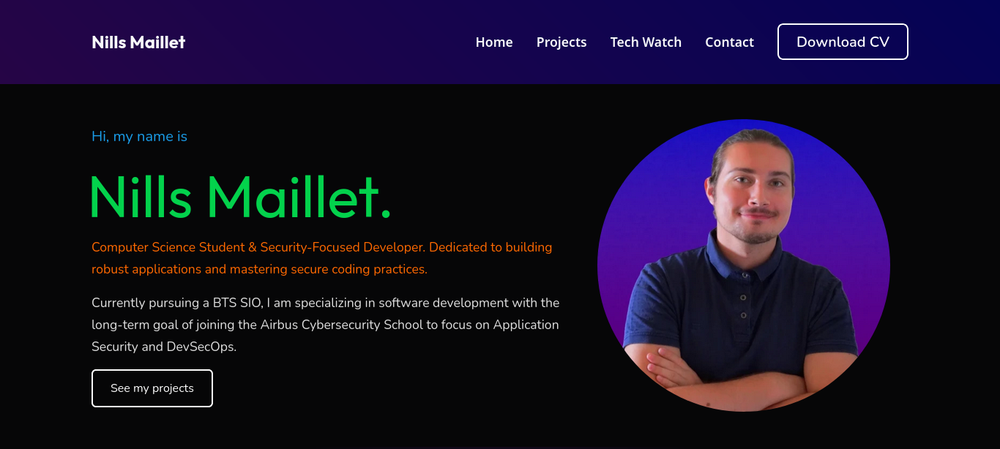

# 🗂️ Personal Portfolio – Nills Maillet

This portfolio is a personal project built to showcase my work, skills, and tech watch.
Developed with a modern frontend stack, it uses **Supabase** as a PostgreSQL backend to dynamically load content without rebuilding the site.
Hosted on **GitHub Pages**, it reflects my approach to clean, maintainable, and scalable web development.

---

## 🎯 Objectives

- Build a modern and responsive personal portfolio
- Connect a frontend to a cloud database (Supabase)
- Dynamically load project data without a traditional backend
- Apply Row Level Security (RLS) to protect data
- Improve skills in HTML, CSS, JavaScript and Bootstrap

---

## 🛠️ Technologies used

- **HTML5** – page structure
- **CSS3** – styling and layout
- **Bootstrap** – responsive design and components
- **JavaScript** – dynamic interactions and DOM manipulation
- **Supabase** – PostgreSQL cloud database and storage

---

## 🗂️ Project structure

- /config
  - supabase.js
- /css
  - style.css
- /images
- /includes
  - header.html
  - footer.html
- /js
  - main.js
  - projects.js
  - contact.js
  - tech-watch.js
- /pages
  - projects.html
  - contact.html
  - tech-watch.html
- index.html
- README.md

---

## ✨ Main features

- Dynamic project showcase loaded from Supabase
- Contact form with data stored in Supabase
- Row Level Security (RLS) configured to protect sensitive data
- Shared header and footer via JavaScript fetch
- Fully responsive design with Bootstrap
- Tech Watch page dedicated to Post-Quantum Cryptography (PQC)

---

## 👨‍💻 Author

Maillet Nills  
Computer Science Student – BTS SIO
